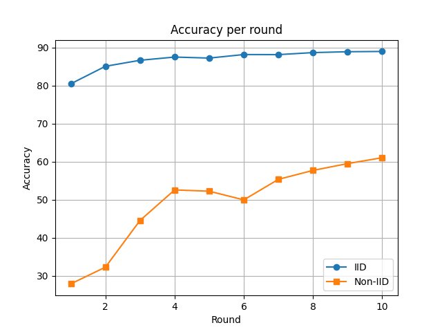
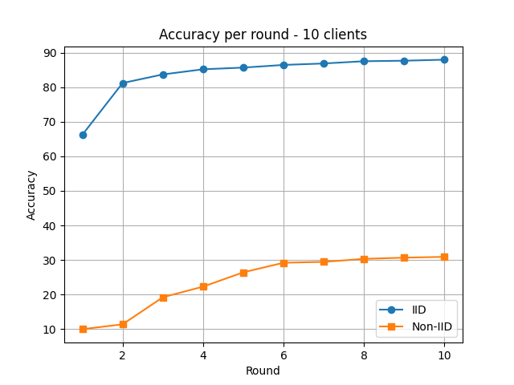

# Federated Learning
Federated Learning (FL)  è un paradigma di apprendimento automatico che consente a più dispositivi o organizzazioni di collaborare all’addestramento di un modello condiviso (ad esempio una rete neurale), 
senza dover centralizzare i dati. Ogni partecipante (client) allena localmente il modello sui propri dati e invia solo aggiornamenti 
(come i nuovi parametri del modello) a un server centrale. Questo approccio permette di preservare la privacy dei dati sensibili e ridurre il traffico di rete.

## Prima simulazione: fashionMNIST
Come prima simulazione consideriamo i client come delle funzioni locali che restituiscono i risultati del proprio ciclo di training sottoforma di 
parametri della rete neurale che stanno allenando. Faremo due esperimenti, entrambi su 10 round di scambio di dati, suddividendo in modo diverso il dataset tra i client:
- Dataset diviso uniformemente tra i client (IID)
- Dataset diviso NON uniformemente tra i client (non-IID)

### Suddivisione IID del Dataset
La suddivisione IID dei dati avviene nel seguente modo:
1. Si creaa una struttura dati che memorizzi, per ogni label, un array di posizioni, ovvero gli indici corrispondenti dei dati nel dataset che hanno quella label. Ogni entry sarà quindi del tipo (label, array-di-indici);
2. Iterando sulle entry, si divide la dimensione dell'array di indici corrispondente per il numero di client, considerando la distribuzione di eventuale resto, ottenendo così la quantità di esempi con quella label che ogni client avrà;
3. Iterando sui client, si distribuiscono gli esempi, ottenendo così una struttura dati che contiene, per ogni client, la lista degli indici del dataset che quel client utilizzerà per il training locale. Ogni entry sarà quindi del tipo (numero-client, array-di-indici);

### Suddivisione non-IID del Dataset
La suddivisione non-IID dei dati avviene nel seguente modo (supponendo di avere n_clients >= n_labels):
1. Si considerano tutte le label del dataset e tutti i client
2. Si itera sui client associando una label a ciascuno
3. Se rimangono delle label non assegnate una volta terminata la prima iterazione sui client, si riparte dal primo client e si continuano ad assegnare le label rimanenti
4. Si ripete il punto 3 fino a quando tutte le label non saranno state assegnate ai client

### Risultati grafici
Di seguito sono mostrati graficamente i risultati ottenuti.
Sono stati utilizzati i seguenti learning rate:
- 5 client (*Figura 1*):
  - Caso IID: learning rate = 2 · 10⁻¹
  - Caso non-IID: learning rate = 6 · 10⁻²
- 10 client (*Figura 2*):
  - Caso IID: learning rate = 7 · 10⁻²
  - Caso non-IID: learning rate = 2 · 10⁻³
 
Notiamo che, nel caso in cui i client siano 10, ciascuno di essi riceve una sola label, dal momento che questi esperimenti fanno riferimento a *fashionMNIST*, un dataset con 10 label. Questo spiega in parte una accuracy nettamente più bassa nel caso di training con 10 client rispetto al caso in cui i client sono 5, dove ognuno riceve 2 label.

 </img>  
*Figura 1*

 </img>  
*Figura 2*

## Fed-Heart-Disease
*Fed-Heart-Disease* è un dataset derivante da *UCI Heart Disease Dataset*, che viene utilizzato in contesti di machine learning centralizzato per predire la presenza o assenza di una malattia cardiaca a partire da 76 parametri medici, in forma tabellare, di un paziente, tra cui età, sesso, pressione sanguigna a riposo e colesterolo. *Fed-Heart-Disease* fa parte della suite di *FLamby*, che mette a disposizione dataset sanitari cross-silo appositi per il federated learning. Il dataset in questione è infatti una suddivisione non-IID di *UCI Heart Disease* in 4 parti, creata appositamente per simulare il training federato sulla base dei dati raccolti da 4 istituti differenti e tra loro indipendenti.
Nello specifico, dei 76 parametri disponibili per ogni paziente, vengono considerati solamente i primi 13, essendo questi i più significativi, completi e facilmente reperibili.
Il task della rete è una semplice classificazione binaria, come anticipato in precedenza, sulla presenza o assenza di una patologia cardiaca.

### Risultati ottenuti
I test sono stati effettuati sia in ambiente centralizzato, unendo precedentemente il dataset che come detto in precedenza è già suddiviso in 4, sia in ambiente federato, ottenendo accuratezze pressochè uguali.

 </img>  
*Figura 3*
