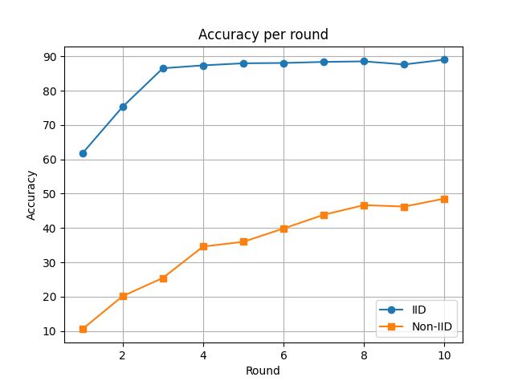
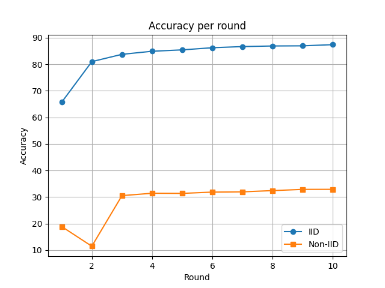

# Federated Learning
Federated Learning (FL)  è un paradigma di apprendimento automatico che consente a più dispositivi o organizzazioni di collaborare all’addestramento di un modello condiviso (ad esempio una rete neurale), 
senza dover centralizzare i dati. Ogni partecipante (client) allena localmente il modello sui propri dati e invia solo aggiornamenti 
(come i nuovi parametri del modello) a un server centrale. Questo approccio permette di preservare la privacy dei dati sensibili e ridurre il traffico di rete.

## Prima simulazione
Come prima simulazione consideriamo i client come delle funzioni locali che restituiscono i risultati del proprio ciclo di training sottoforma di 
parametri della rete neurale che stanno allenando. Faremo due esperimenti, entrambi su 10 round di scambio di dati, suddividendo in modo diverso il dataset tra i client:
- Dataset diviso uniformemente tra i client
- Dataset diviso NON uniformemente tra i client

### Suddivisione IID del Dataset
La suddivisione IID dei dati avviene nel seguente modo:
1. Si divide il numero di esempi totali presenti nel dataset per il numero di client e si distribuisce l'eventuale resto, ottenendo così il numero di esempi in ogni partizione
2. Si suddivide randomicamente il dataset sulla base delle dimensioni calcolate
3. Si associa ogni partizione a un client, che verrà quindi allenato solo su quella partizione

### Suddivisione non-IID del Dataset
La suddivisione non-IID dei dati avviene nel seguente modo (supponendo di avere n_clients >= n_labels):
1. Si considerano tutte le label del dataset e tutti i client
2. Si itera sui client associando una label a ciascuno
3. Se rimangono delle label non assegnate una volta terminata la prima iterazione sui client, si riparte dal primo client e si continuano ad assegnare le label rimanenti
4. Si ripete il punto 3 fino a quando tutte le label non saranno state assegnate ai client
Notiamo che nel caso in cui i client sono 10, ciascuno riceve una sola label da momento che questi esperimenti fanno riferimento a fashionMNIST, un dataset con appunto 10 label; questo spiega perchè i risultati di training con 10 client restituiscano un'accuracy più bassa rispetto allo stesso caso ma con 5 client.

### Risultati grafici
Di seguito sono mostrati graficamente i risultati ottenuti.
Sono stati utilizzati i seguenti learning rate:
- 5 client (*Figura 1*):
  - Caso IID: learning rate = 2 · 10⁻¹
  - Caso non-IID: learning rate = 8 · 10⁻²
- 10 client (*Figura 2*):
  - Caso IID: learning rate = 7 · 10⁻²
  - Caso non-IID: learning rate = 2 · 10⁻³

 </img>  
*Figura 1*

 </img>  
*Figura 2*
