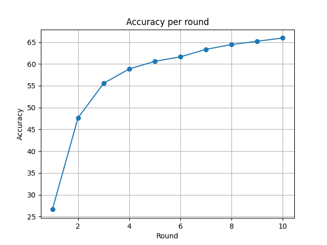
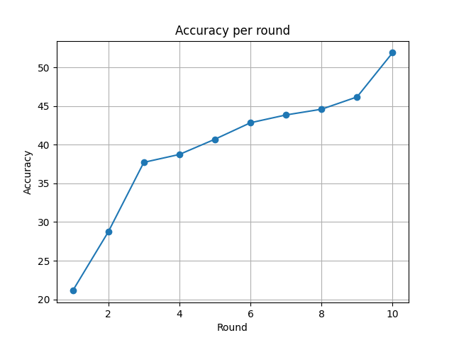

# Federated Learning
Federated Learning (FL)  è un paradigma di apprendimento automatico che consente a più dispositivi o organizzazioni di collaborare all’addestramento di un modello condiviso (ad esempio una rete neurale), 
senza dover centralizzare i dati. Ogni partecipante (client) allena localmente il modello sui propri dati e invia solo aggiornamenti 
(come i nuovi parametri del modello) a un server centrale. Questo approccio permette di preservare la privacy dei dati sensibili e ridurre il traffico di rete.

## Prima simulazione
Come prima simulazione consideriamo i client come delle funzioni locali che restituiscono i risultati del proprio ciclo di training sottoforma di 
parametri della rete neurale che stanno allenando. Faremo due esperimenti, entrambi su 10 round di scambio di dati, suddividendo in modo diverso il dataset tra i client:
- Dataset diviso uniformemente tra i client
- Dataset diviso NON uniformemente tra i client

### Dataset diviso uniformemente
- Figura 1: 5 client
- Figura 2: 10 client

</img>
*Figura 1.*

</img>
*Figura 2.*

### Dataset diviso non uniformemente
La suddivisione non-IID dei dati avviene nel seguente modo (supponendo di avere n_clients >= n_labels):
1. Si considerano tutte le label del dataset e tutti i client
2. Si itera sui client associando una label a ciascuno
3. Terminata l'iterazione sui client, si riparte dal primo client e si continuano ad assegnare le label rimanenti
4. Se necessario, si ripete il punto 3 fino a quando le label saranno tutte assegnate
- Figura 3: 5 client
- Figura 4: 10 client

</img>
*Figura 3.*

</img>
*Figura 4.*
